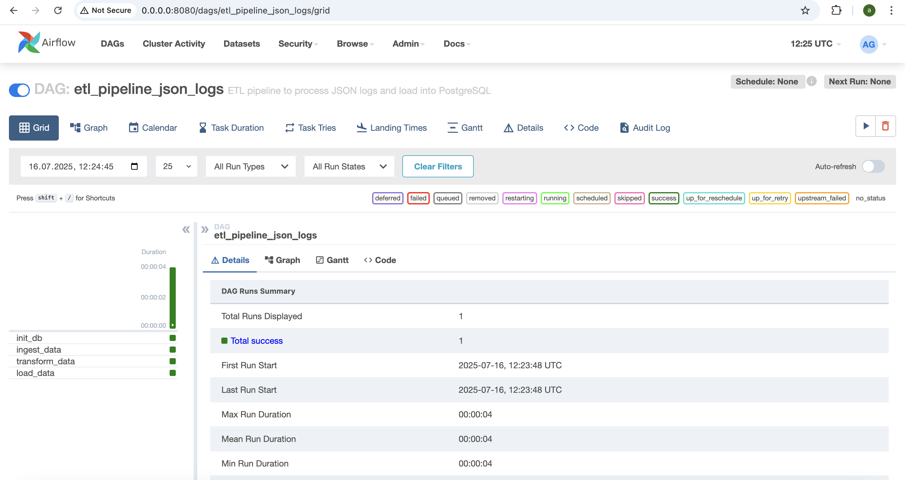
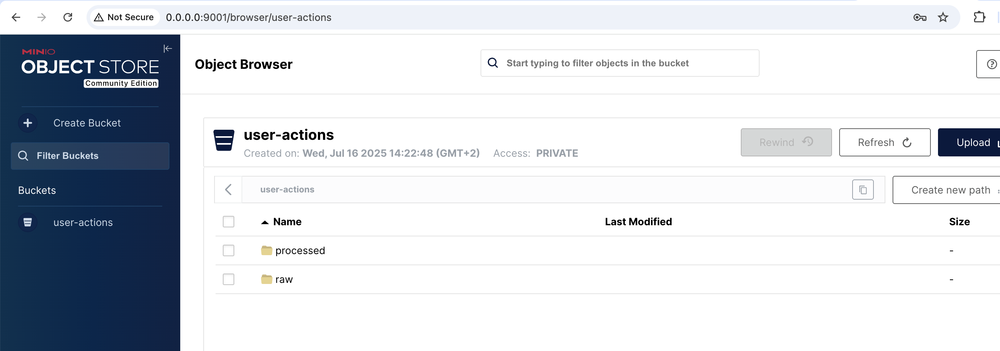
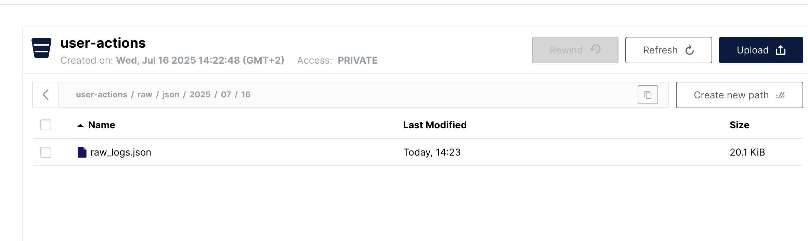
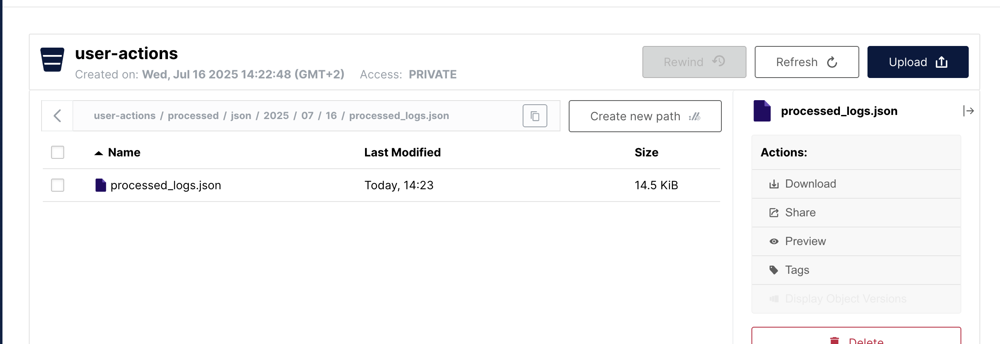
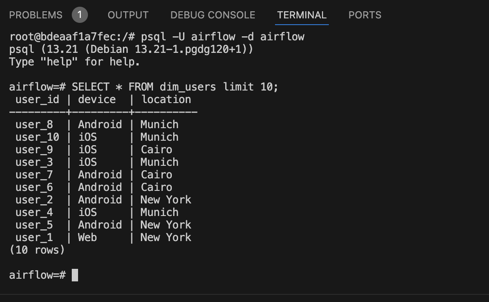
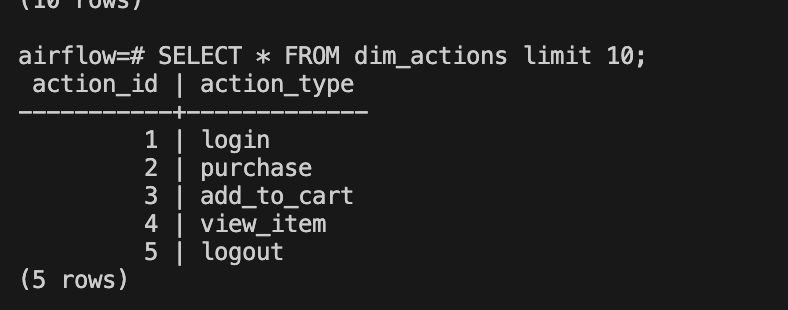
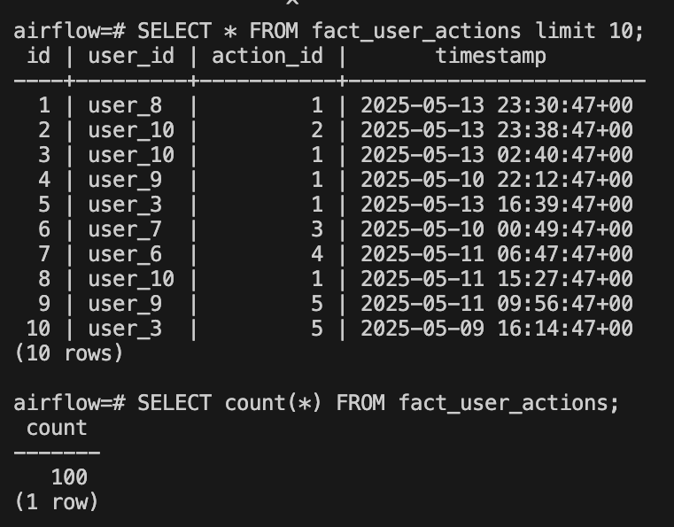

# Simple ETL Pipeline

## Objective
Build a simple ETL pipeline that ingests raw JSON logs, transforms the data into a clean format, models it into a star schema, and loads it into a relational database (PostgreSQL).

## Project Overview
This project implements an end-to-end ETL pipeline for mobile app logs. The pipeline:

- Ingests raw JSON logs from a sample data file.

- Cleans and transforms data to ensure quality and consistency.

- Models the data into a star schema optimized for analytical queries.

- Loads the data into a relational database.

- Orchestrates workflow execution using Airflow.

- Runs inside Docker containers for portability and ease of deployment

## MinIO Storage Integration

This project uses MinIO as an S3-compatible object storage system to manage both raw and processed data throughout the ETL pipeline.

### Bucket Folder Structure
The object paths follow the format:

    user-actions/
    ├── raw/
    │   └── json/
    │       └── YYYY/
    │           └── MM/
    │               └── DD/
    │                   └── raw_logs.json
    ├── processed/
    │   └── json/
    │       └── YYYY/
    │           └── MM/
    │               └── DD/
    │                   └── processed_logs.json

### MinIO Access Details
You can access the MinIO browser interface at:

    http://0.0.0.0:9000

Login using the credentials provided in your .env file (typically MINIO_ACCESS_KEY and MINIO_SECRET_KEY).

## Requirements & Implementation Details

1) Data Ingestion

    - Load raw JSON logs from src/data/raw_logs.json.

2) Data Cleaning & Transformation

    - Convert all timestamps to ISO 8601 format.

    - Remove records missing user_id or action_type.

    - Extract and normalize useful fields like device type and location.

3) Data Modeling

    - Design and implement a star schema with the following tables:

        fact_user_actions (central fact table)

        dim_users (user dimension)

        dim_actions (action dimension)

4) Data Loading

    - Load cleaned and modeled data into a PostgreSQL database.

5) Data Quality Checks

    - Implement validations to check for nulls and duplicates.

6) Orchestration

    - Use Apache Airflow to manage and schedule ETL workflow.

7) Containerization

    - Dockerize the pipeline and orchestration components to enable easy setup and execution.

## How to Run

1) Clone the repository

        git clone https://github.com/gantaAishwarya/data_pipeline.git
        cd data_pipeline

2) Start services with Docker Compose

        docker-compose up

3) Access Airflow UI

    - Open http://localhost:8080 in your browser to monitor ETL DAGs.

4) Trigger ETL pipeline

    - Trigger the DAG manually or let it run on schedule.

## Testing

- Unit tests are located in the tests/ directory.
- Run tests with:

        pytest tests/

## Successful Job Execution Overview

Once the Airflow DAGs have run successfully, you can expect the following:

### Airflow UI Snapshot

### Data Ingested into MinIO

Raw and processed data will be available in MinIO buckets:

### Data in PostgreSQL

Transformed data will be available in the respective Postgres tables:

- dim_users Table

    

- dim_actions Table

    

- fact_user_actions Table

    

